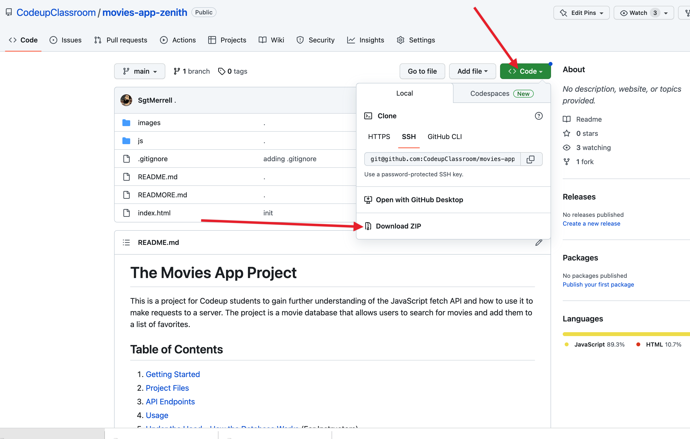

# The Movies App Project

This is a project for Codeup students to gain further understanding of the JavaScript fetch API and how to use it to make requests to a server. The project is a movie database that allows users to search for movies and add them to a list of favorites.

## Table of Contents  
1. [Getting Started](#getting-started)
2. [Project Files](#project-files)
3. [API Endpoints](#firebase-endpoints)
4. [Usage](#usage)
5. [Under the Hood - How the Database Works](/READMORE.md) (For Instructors)


## Getting Started

1. Create an organization on GitHub for your team.
2. Add your team members as owners to the organization.
3. Create a new repository in your organization called `movies-app`. **Do not initialize it with a README**.
4. Copy the SSH clone URL for the repository created and save it for later.
5. Download **this repository** as a zip file.
[](images/download-repo.png)
6. Create a local folder for your project and name it `movies-app`
7. Open the zip file and copy the contents of the `movies-app` folder into your local `movies-app` folder.
8. Open your local `movies-app` folder in your code editor.
9. Open the terminal and run the following commands:
```bash
git init
git add .
git commit -m "Initial commit"
git branch -M main
git remote add origin PASTE_YOUR_REPOSITORY_CLONE_URL_HERE
git push -u origin main
```
10. Paste your `keys.js` file (provided by your instructor) into the `js` directory. (This file is ignored by git)
11. Change the `YOUR_TEAM_NAME` in the `movies-api.js` file to your team name.
```js 
let db = new FirebaseDatabase({
    team: "YOUR_TEAM_NAME" // Replace this with your team name
});
```
12. Open the `index.html` file in your browser.
13. Your team is now ready to start working on the project! Happy coding!

> **Note**
> Whenever `index.html` is opened in the browser, the configuration will check to see if a table for your team name has any data. If it does not, it will create a table for your team name and populate it with a few example movies. This is done so that you can start working on the project without having to add any data to the database. **This means that if you ever remove all of the data from your table, the configuration will add the example movies again the next time you open `index.html` in the browser.**

## Project Files

The project has the following files:

| File Name | Description |
| --- | --- |
| `index.html` | The html page that will run the javascript and display your app |
| `js/firebase-config.js` | Inits all necessary firebase configuration and defines the `FirebaseDatabase` class |
| `js/movies-api.js` | Defines the `db` object that will be used to make requests to the database, <br>along with a few example functions to get you started. <br>Add any additional functions that interact with the database here.  |
| `js/index.js` | The main entry point for your application. Add all DOM manipulation code here. |
## API Endpoints

This Firebase API has the following endpoints:

- `GET /movies` - returns an array of all movies
- `GET /movies/{id}` - returns a single movie with the given id
- `POST /movies` - creates a new movie and returns the id of the new movie
- `PUT /movies/{id}` - updates the movie with the given id
- `DELETE /movies/{id}` - deletes the movie with the given id
## Usage

You will use the db object to make requests to the database similarly to how you would use the fetch function to make requests to an API. The only difference is that you will be adding "db" in front of the fetch function.

Example:
```js
db.fetch(url, options);
```

This lets you make requests to the database using the same syntax as you would use to make requests to a normal API. 

Here's an example of a function that **gets all movies** from the database:
```js
const getMovies = async () => {
    try {
        const url = '/movies';
        const options = {
            method: 'GET',
            headers: {
                'Content-Type': 'application/json',
            }
        };
        let response = await db.fetch(url, options);
        return await response.json();
    } catch (e) {
        console.error(e);
    }
}
```
An example of a function that **gets a specific movie** in the database:
```js
const getMovie = async (movie) => {
    try {
        const url = `/movies/${movie.id}`;
        const options = {
            method: 'GET',
            headers: {
                'Content-Type': 'application/json',
            }
        };
        let response = await db.fetch(url, options);
        return await response.json();
    } catch (e) {
        console.error(e);
    }
}
```
An example of a function that **adds a movie** in the database:
```js
const addMovie = async (movie) => {
    try {
        const url = '/movies';
        const options = {
            method: 'POST',
            headers: {
                'Content-Type': 'application/json',
            },
            body: JSON.stringify(movie),
        };
        let response = await db.fetch(url, options);
        return await response.json();
    } catch (e) {
        console.error(e);
    }
}
```
An example of a function that **updates a movie** in the database:
```js
const updateMovie = async (movie) => {
    try {
        const url = `/movies/${movie.id}`;
        const options = {
            method: 'PUT',
            headers: {
                'Content-Type': 'application/json',
            },
            body: JSON.stringify(movie),
        };
        let response = await db.fetch(url, options);
        return await response.json();
    } catch (e) {
        console.error(e);
    }
}
```
An example of a function that **deletes a movie** in the database:
```js
const deleteMovie = async (movie) => {
    try {
        const url = `/movies/${movie.id}`;
        const options = {
            method: 'DELETE',
            headers: {
                'Content-Type': 'application/json',
            }
        };
        let response = await db.fetch(url, options);
        return await response.json();
    } catch (e) {
        console.error(e);
    }
}
```
